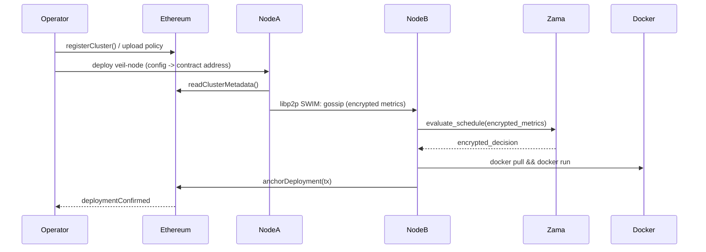

## ** FHEVM Veil Stack**

**A Confidential, Decentralized Container Orchestration Layer Powered by FHE**

**Veil Stack** is a **privacy-preserving, decentralized container orchestration platform** that enables organizations and distributed compute networks to securely schedule and manage containerized workloads **without exposing sensitive operational data**. Built on **libp2p** for peer-to-peer coordination and anchored by an **Ethereum smart contract** for shared state and governance, Veil Stack introduces **Zama’s Universal Fully Homomorphic Encryption (FHE) SDK** to enable **encrypted cluster telemetry, scheduling decisions, and policy enforcement**.

In Veil Stack, cluster nodes never need to reveal their resource utilization metrics, performance data, or workload profiles. Instead, orchestration logic operates directly on **encrypted inputs**, ensuring that:

* **Resource data remains confidential**
* **Scheduling decisions remain optimal**
* **No cluster member gains insight into another’s infrastructure**
* **The orchestration layer is trustless and verifiable**

This makes Veil Stack the first orchestration system capable of operating in **zero-trust distributed compute environments**, where nodes may be owned by different organizations, providers, or decentralized network participants.

---

### **Why Veil Stack Matters**

Conventional orchestrators (Kubernetes, Nomad, DC/OS) require centralized control and **full visibility** into all cluster internals. This creates risks:

* Sensitive performance or topology data can leak.
* Cross-institutional collaboration becomes impossible without trust.
* Operators are forced to centralize their infrastructure and governance.

Veil Stack removes that trust bottleneck.

By combining:

| Component                   | Responsibility                                                                      |
| --------------------------- | ----------------------------------------------------------------------------------- |
| **libp2p**                  | Peer discovery, messaging, cluster health gossip (SWIM)                             |
| **Ethereum smart contract** | State anchoring, membership registry, governance & cluster metadata                 |
| **Zama Universal FHE SDK**  | Encrypted scheduling, encrypted decision functions, confidential policy enforcement |

Veil Stack turns container orchestration into a **trust-minimized protocol**, not a centralized control plane.

---

### **Key Capabilities**

| Capability                                | Description                                                                                        |
| ----------------------------------------- | -------------------------------------------------------------------------------------------------- |
| **Encrypted Resource Scheduling**         | Nodes share encrypted utilization and performance signals; scheduling runs entirely on ciphertext. |
| **Zero-Trust Cluster Federation**         | Multiple organizations can operate as one cluster without exposing internal infrastructure.        |
| **Decentralized Control Plane**           | No single point of failure; operations continue even if nodes drop offline.                        |
| **Confidential Replication & Redundancy** | Workloads can be mirrored across nodes without revealing topology or load patterns.                |

---

### **Example Use Cases**

* **Healthcare compute cooperatives** where patient-data-derived workloads require strict confidentiality
* **Cross-cloud ML training clusters** where cloud providers should not see competitor data
* **Decentralized cloud and edge compute networks** where participants are semi-trusted or anonymous
* **Governmental or defense computing environments** requiring operational secrecy

---

### **Outcome**

Veil Stack creates the foundation for the **Confidential Decentralized Cloud** — where compute is:

* Peer-to-peer
* Verifiable
* Always available
* And **encrypted end-to-end**

# Veil Stack — Architecture Diagram

This document provides a **text-based architecture diagram** and explanation suitable for inclusion in a GitHub repo README. It uses ASCII/mermaid diagrams and step-by-step flows to describe how Veil Stack (Veil Stack = canteen + Zama FHE + libp2p + Ethereum) coordinates privacy-preserving, decentralized container orchestration.

---

## Overview

Veil Stack is a decentralized orchestration layer that performs scheduling and policy evaluation on **encrypted telemetry** using Zama's Universal FHE SDK. The network relies on **libp2p** for peer-to-peer networking and SWIM-style health gossip, and an **Ethereum smart contract** for membership, governance, and anchoring important cluster metadata.

This file contains:

* A high level ASCII diagram
* A mermaid sequence diagram (GitHub-friendly)
* Component descriptions
* Data flow / step-by-step scheduling flow
* Example configuration snippets (env / contract pointers)

---

## High-level ASCII diagram

```
+----------------------+      +----------------------+      +----------------------+
|   Operator / UI      | <--> |  Ethereum / Smart    | <--> |  Governance / ACLs   |
|  (CLI / Dashboard)   |      |  Contract (Registry) |      |  (on-chain policies) |
+----------------------+      +----------------------+      +----------------------+
         ^   |                          ^   |                         
         |   |                          |   |                       
         |   v                          |   v                       
+----------------------+      +----------------------+      +----------------------+
|   Veil Node A        | <--> |   Veil Node B        | <--> |   Veil Node C        |
|  (libp2p host)       |      |  (libp2p host)       |      |  (libp2p host)       |
|  - SWIM gossip       |      |  - SWIM gossip       |      |  - SWIM gossip       |
|  - Zama FHE runtime  |      |  - Zama FHE runtime  |      |  - Zama FHE runtime  |
|  - Encrypted metrics |      |  - Encrypted metrics |      |  - Encrypted metrics |
|  - Local DockerExec  |      |  - Local DockerExec  |      |  - Local DockerExec  |
+----------------------+      +----------------------+      +----------------------+
         |                           |                           |
         v                           v                           v
+----------------------+      +----------------------+      +----------------------+
|  Docker Host(s)      |      |  Docker Host(s)      |      |  Docker Host(s)      |
|  (runs containers)   |      |  (runs containers)   |      |  (runs containers)   |
+----------------------+      +----------------------+      +----------------------+

```

*Notes:*

* Veil Nodes form a mesh using **libp2p** for discovery and messaging.
* Scheduling inputs (CPU, mem, priority) are encrypted with **Zama FHE**; scheduling decision logic operates on ciphertexts.
* The Ethereum smart contract holds registry, membership, and high-level governance metadata (e.g., allowed images, staking, ACLs).

---

## Mermaid sequence diagram (GitHub rendered)




## Component descriptions

**Operator / Dashboard**

* CLI or web dashboard used by cluster admins to register clusters, define policies, and publish container images (images still on Docker Hub / registry).

**Ethereum Smart Contract (Registry / Governance)**

* Stores cluster registry, operator keys, ACLs, allowed image lists, and anchors important lifecycle events (e.g., deployments).
* Provides on-chain governance hooks to dispute or audit scheduling outcomes (high level only — heavy computation is off-chain).

**Veil Node (Veil Stack runtime)**

* `libp2p` host for peer discovery, pubsub, and direct messaging.
* Implements a SWIM-like health protocol to maintain liveness information.
* Integrates **Zama Universal FHE SDK** to encrypt and compute on telemetry.
* Exposes local container runtime access (Docker / containerd) for launching workloads.
* Can operate with optional state-channels / off-chain compute layers for heavier scheduling ops.

**Zama FHE Runtime**

* Provides encryption, ciphertext arithmetic, and evaluation APIs. Scheduling logic (e.g., cost function) is expressed as FHE evaluable circuits or functions.
* Ciphertext inputs: node resource metrics, node priority, replica preferences, constraints.
* Ciphertext outputs: scheduling decisions (which node(s) should host a given container), which then are decrypted by the requester or a designated decryption authority (depending on trust model).

**Docker Host(s)**

* Hosts actually run container images; they are controlled by the local Veil Node's DockerExec.
* Images are still pulled from regular registries (e.g., Docker Hub, private registries). Image manifests and signatures can be anchored on-chain or via registry.

---

## Data flow & scheduling steps (detailed)

**1. Cluster registration**

* Operator deploys the Veil Stack smart contract (or uses an existing one).
* Operator registers node identities (libp2p peerIDs) and governance keys with the contract.

**2. Node boot & discovery**

* Each Veil Node boots with configuration pointing to the contract address and local FHE key material (public key share or ephemeral key depending on the model).
* Nodes join mesh via libp2p and exchange encrypted heartbeats / metrics via SWIM.

**3. Encrypted telemetry exchange**

* Each node gathers resource metrics (CPU, mem, disk, GPU availability, latency) and encrypts them with Zama's FHE public key.
* Encrypted metrics are gossiped or sent to the candidate scheduler nodes.

**4. FHE scheduling evaluation**

* A scheduler (could be elected via simple leader-election or run redundantly) collects ciphertexts and runs the scheduling cost function under FHE using Zama.
* The evaluation returns encrypted assignment decisions.

**5. Decision decryption & enforcement**

* Depending on privacy model:

  * *Designated decryptor model:* a trusted operator key (or multi-party threshold) decrypts assignments, and nodes enforce the decisions.
  * *Zero-knowledge reveal model:* only minimal metadata (e.g., which node will run replica) is revealed to relevant parties.
* Veil Node pulls images and invokes local container runtime to start the container.

**6. Anchor deployment on-chain**

* Nodes optionally post a deployment transaction to the contract with a hash/commitment of the assignment and metadata.
* This allows auditing and dispute resolution while keeping raw telemetry private.

---

## Example configuration snippets

**Environment variables (example)**

```bash
# Veil node config
VEIL_CONTRACT_ADDRESS=0xAbC...123
VEIL_LIBP2P_BOOTSTRAP=/ip4/1.2.3.4/tcp/4001/p2p/QmBootstrap
VEIL_ZAMA_PUBLICKEY_FILE=/etc/veil/zama_pubkey.bin
VEIL_NODE_PEERID=Qm...
VEIL_DOCKER_SOCKET=/var/run/docker.sock
```

**Smart contract: basic interface (pseudo ABI)**

```solidity
interface IVeilRegistry {
  function registerNode(bytes32 peerID, address operator) external;
  function anchorDeployment(bytes32 assignmentHash) external returns (bool);
  function getClusterPolicy() external view returns (bytes memory);
}
```

---

## Notes on threat model & privacy choices

* **FHE guarantees**: Computations on telemetry remain ciphertext-only to nodes performing the computation. The final model depends on who holds decryption keys.
* **Key management**: Consider multi-party threshold decryption or secure enclaves to reduce trusted parties.
* **Attestation**: Use libp2p peerIDs and on-chain anchors to attest to node identities and state.
* **Auditability**: Put compact commitments on-chain (hashes) rather than raw telemetry to preserve privacy while enabling transparency.

---

## Extensions & TODO

* Add merkle commitments for container image manifests and anchor them on-chain.
* Add an optional state-channel layer for high-frequency scheduling updates.
* Implement multiple scheduling policies (priority round-robin, bin-packing under FHE, cost-minimization for latency-sensitive tasks).
* Provide a reference configuration for threshold FHE decryption (MPC + Zama bridge).

---

### Appendix: Quick start pointers

1. Deploy the Veil Registry contract to your EVM chain and note the address.
2. Configure a small 3-node mesh with libp2p bootstrap peers and place Zama public keys on each node.
3. Launch nodes pointing to the contract address and register peers on-chain.
4. Start encrypted telemetry gossip and run the reference FHE scheduling example.


